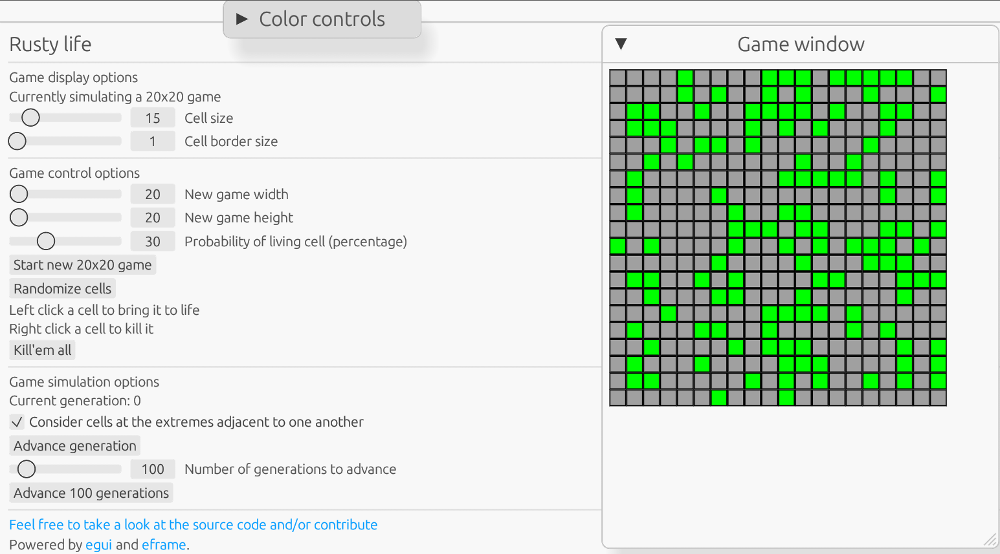

# rusty-life
Conway's Game of Life in immediate-mode GUI for the web

A live version can be accessed [here](https://rustylife.netlify.app/)

## Features:
* Custom board dimensions and display
* Customizing the board by simply clicking on it
* Board randomization with adjustable probability
* Option to make cells at the extremes of the board adjacent to one another, which can, for instance, make [gliders](https://conwaylife.com/wiki/Glider) propel indefinitely (active by default)
* Batch-advancing the simulation a certain number of generations

## To build:
* Run "cargo build" or "cargo build --release" for the *desktop* build
* Run "trunk serve" or "trunk serve --release" for the *web* build (requires [trunk](https://github.com/trunk-rs/trunk))

Suggestions/contributions are welcome!